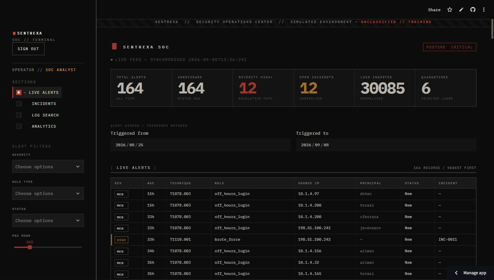
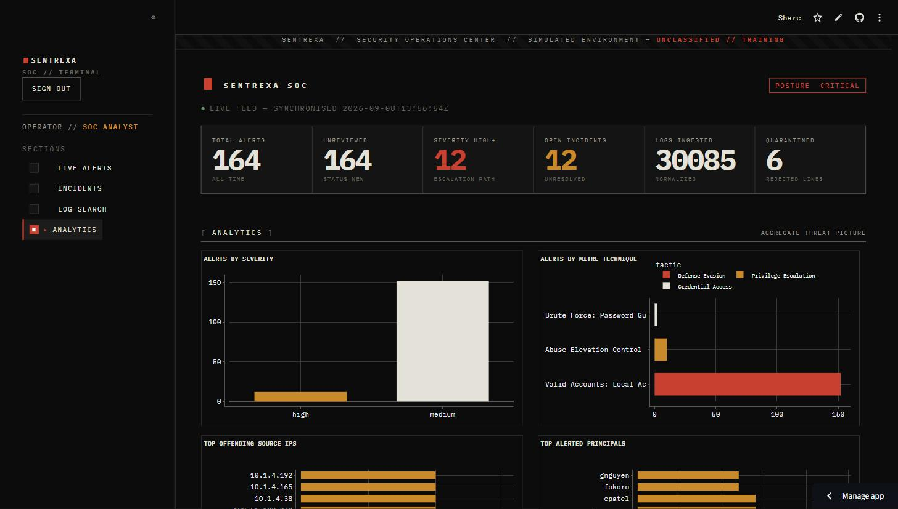

# Sentrexa

**A simulated Security Operations Center — from synthetic threat activity to a cloud analytics warehouse.**


Sentrexa is an end-to-end security-analytics pipeline in miniature. It
**manufactures its own threat activity** — realistic auth / web / firewall logs
seeded with brute-force bursts, off-hours logins and privilege-escalation
attempts — then runs that stream through a full SOC workflow: normalize into
PostgreSQL, detect with a rule engine whose rules live **in the database, not
the code**, raise **MITRE ATT&CK**-tagged alerts, auto-escalate the serious ones
into incident tickets, and present the result in an auth-gated analyst
dashboard. A second track syncs a denormalized star schema into **BigQuery** for
BI tools, authenticating with keyless **Workload Identity Federation**.

It's a portfolio project built with the discipline of a real one:
least-privilege database roles, idempotent pipeline stages, malformed input
*quarantined* rather than dropped, keyless cloud auth, and a test suite aimed
squarely at the detection logic.

> 🔗 **Live demo:** https://sentrexa-fzxkw3qwjddmiyjldppw72.streamlit.app/
>
> 🔒 The live dashboard requires authentication. Message me at **[YOUR CONTACT HERE]** for demo credentials.

| Live alert feed | Aggregate analytics |
|---|---|
|  |  |

---

## What it does

```
 synthetic logs ──▶ ingest & normalize ──▶ PostgreSQL (logs_raw)
   (auth/web/fw,          parse + validate;      │
    seeded attacks)       bad lines quarantined  │
                                                 ▼
                          rule engine ──▶ alerts (+ MITRE technique/tactic)
                       (rules read from            │
                        detection_rules)           ▼
                                          high-severity ──▶ incidents
                                          auto-escalate      (status workflow)
                                                 │
                    ┌────────────────────────────┼────────────────────────────┐
                    ▼                            ▼                            ▼
          Streamlit dashboard          weekly HTML report          BigQuery sync (Phase 7)
          (live feed, incident         (Jinja2 template)           watermark + idempotent MERGE
           board, log search,                                      into a star schema
           analytics)                                              → Looker Studio / Power BI / Tableau

GitHub Actions runs the simulate→ingest→detect cycle on a schedule, then the
BigQuery sync. Every stage writes a row to detection_run_log.
```

**Detection rules** (stored as rows in `detection_rules`, dispatched by
`detection/rules_engine.py`):

| Rule | Logic | MITRE |
|------|-------|-------|
| **SSH brute-force burst** | ≥ N failed SSH logins from one `source_ip` inside a sliding window; contributing logs = every failure in a qualifying window; one alert per (rule, IP, day) | `T1110.001` Password Guessing · *Credential Access* |
| **Off-hours successful login** | A successful `login` whose UTC hour falls inside the configured `[start, end)` window (wraps midnight); one alert per login | `T1078.003` Valid Accounts: Local Accounts · *Defense Evasion* |
| **Privilege escalation via sudo** | An `auth` line containing any configured keyword — `sudo su`, `usermod -aG sudo`, `GRANT ALL PRIVILEGES`, … (case-insensitive); one alert per line | `T1548.003` Sudo and Sudo Caching · *Privilege Escalation* |

Thresholds, windows, keywords and severities are columns/JSON on each rule row —
change behaviour without touching code. `mitre/technique_reference.py` is the
small curated table the rule→technique mapping is seeded from.

## Tech stack

| Layer | Tools |
|-------|-------|
| **Language / runtime** | Python 3.14 |
| **Operational store** | PostgreSQL 18 (Neon), SQLAlchemy 2 (ORM / bound parameters only) |
| **Synthetic data** | Faker, seeded RNG (deterministic feeds) |
| **Detection & alerting** | pure-Python rule engine, config-driven from the DB |
| **Dashboard** | Streamlit + Plotly, `streamlit-authenticator` login gate |
| **Reporting** | Jinja2 → self-contained weekly HTML |
| **Analytics warehouse** | Google BigQuery (`google-cloud-bigquery`), star schema |
| **BI** | Looker Studio · Power BI · Tableau (read-only, OAuth) |
| **CI / automation** | GitHub Actions — scheduled pipeline + BigQuery sync (Workload Identity Federation, no keys) |
| **Testing** | pytest, focused on `detection/rules_engine.py` |

## Engineering notes

- **Rules are data, not code.** The engine loads active rows from
  `detection_rules` and dispatches one pure detector per `rule_type`. Tuning is a
  DB update.
- **Idempotent everywhere.** Ingestion dedupes on a content hash; detection only
  consumes `processed = false` rows and flips them in the same transaction;
  alerts upsert on a `dedup_key`; the BigQuery sync stages + `MERGE`s on natural
  keys behind a watermark. Re-running any stage is a no-op — there's a test for
  each.
- **Least privilege.** `sentrexa_ro` (SELECT only) backs the dashboard and
  reports; `sentrexa_rw` (SELECT/INSERT/UPDATE, no DELETE, no DDL) backs the
  pipeline. Bootstrap verifies `ro` cannot write.
- **Fail safe on bad input.** Unparseable log lines go to a `rejected_records`
  table with a reason — never dropped, never crash the pipeline.
- **Keyless cloud auth.** No service-account JSON key exists in the project. CI
  uses GitHub OIDC → Workload Identity Federation; local runs and BI tools use
  the developer's own Google account. `logs_raw` is never exported — only
  alert-level and aggregated data leaves PostgreSQL.
- **MITRE mapping is a real join.** `v_alert_enriched` pre-joins
  alert → rule → technique/tactic → incident so the dashboard, the report and
  BigQuery all read one denormalized shape.

## Architecture

```
[Log Simulator] -> [Ingestion & Normalization] -> [PostgreSQL: logs_raw]
      -> [Detection Rule Engine] (reads detection_rules) -> [Alerts + MITRE mapping]
      -> [high-severity alerts auto-escalate] -> [Incidents]
             |                                        |
             v                                        v
     [Streamlit dashboard]                    [BigQuery sync]  (Phase 7)
     [Weekly report]

GitHub Actions -> schedules the simulate -> ingest -> detect cycle, then the sync
detection_run_log <- one row per stage, every run
rejected_records  <- malformed log lines, quarantined (never dropped)
```

Modules are isolated by concern: `simulation/`, `ingestion/`, `detection/`,
`alerting/`, `dashboard/`, `reports/`, `bi_export/`, with the shared data layer
in `db/` and every tunable in `config/settings.py`.

The dashboard uses a **"declassified terminal"** visual language — near-black
ground, IBM Plex Mono throughout, hard 1px rules, square corners, and a
restrained palette (oxidised stamp-red for CRITICAL / classification, field
amber for HIGH, drab olive for resolved); severity reads by descending emphasis
and `[CRIT]` / `[HIGH]` / `[MED ]` / `[LOW ]` brackets. Built entirely through a
`.streamlit/config.toml` theme + one injected CSS block + `st.markdown`
fragments (`dashboard/ui.py`).

## Local setup

Prerequisites: **Python 3.14** and a PostgreSQL database (local or hosted).

```bash
python -m pip install -r requirements.txt
cp .env.example .env                 # then set DATABASE_URL to your DB owner

# provision: schema + views, least-privilege roles (generated passwords land in .env),
# then seed the MITRE techniques + detection rules
python -m sql.bootstrap
python -m detection.seed

# run one full cycle
python -m simulation.dataset                 # -> data/raw/<end>.ndjson  (+ --inject-malformed N)
python -m ingestion.load                     # feed -> logs_raw; bad lines -> rejected_records
python -m detection.runner --commit          # detect -> alerts + incidents; log the run

# analyst dashboard (set your own login first)
python -m dashboard.hash_password 'choose-a-password'   # -> paste into DASHBOARD_AUTH_PASSWORD_HASH
streamlit run dashboard/app.py

# weekly report
python -m reports.weekly_report              # -> reports/out/weekly_<date>.html

# tests  (DB / BigQuery integration tests auto-skip when unreachable)
pytest -q                 # everything
pytest -m "not db" -q     # fast, offline
```

`.env` is gitignored — it never holds anything the repo should see. `.env.example`
and `.streamlit/secrets.toml.example` carry placeholder values only.

## Automation & deployment

**`.github/workflows/pipeline.yml`** — runs `pytest -m "not db"` then
simulate → ingest → detect every 6 hours (and on demand).
**`.github/workflows/bigquery_sync.yml`** — runs the BigQuery sync ~30 min
later, authenticating via Workload Identity Federation.

Repository secrets (connection strings from `python -m sql.bootstrap`; GCP
values are identifiers, not credentials):

```
DATABASE_URL, DATABASE_URL_RW, DATABASE_URL_RO
GCP_PROJECT_ID, GCP_SYNC_SA, GCP_WIF_PROVIDER
```

The dashboard deploys to **Streamlit Community Cloud** (entrypoint
`dashboard/app.py`; paste the keys from `.streamlit/secrets.toml.example` into
the Secrets box) or **Render** (`render.yaml` blueprint). Both run read-only
(`sentrexa_ro`) behind the login gate; HTTPS from the platform.

## BigQuery analytics layer

The sync reads PostgreSQL **only** through `sentrexa_ro` and writes only to
BigQuery; the incremental watermark lives in `analytics._sync_state` in
BigQuery, so nothing is written back to the operational DB.

| Table | Grain | Key | Notes |
|-------|-------|-----|-------|
| `fact_alerts` | one row per alert | `alert_id` | denormalized: rule + technique/tactic + incident outcome. Partitioned on `triggered_at`, clustered on `(severity, mitre_technique_id)` |
| `fact_logs_daily` | one row per `day × source × event_type × status` | those 4 | daily `event_count`; partitioned on `log_date` |
| `dim_mitre_techniques` | one per technique | `technique_id` | |
| `dim_detection_rules` | one per rule | `rule_id` | |

`fact_alerts` re-syncs rows whose `GREATEST(alert.updated_at,
incident.updated_at)` beats the watermark; `fact_logs_daily` recomputes only the
dates that received new logs. Every load stages into `_stage_<table>` then
`MERGE`s on the natural key, so re-runs never duplicate rows
(`tests/test_bi_sync.py`).

Provisioning commands: [`bi_export/PROVISIONING.md`](bi_export/PROVISIONING.md).
BI-tool connection walk-throughs (Looker Studio, Power BI with DAX +
drill-through, Tableau time-of-day heatmap):
[`docs/BI_CONNECTIONS.md`](docs/BI_CONNECTIONS.md).

## What I'd revisit if this were more than a portfolio project

- **Brute-force window continuity** — detection processes each unprocessed batch
  independently, so a burst split across two ingest runs could slip past the
  sliding window. A real fix looks back `time_window_minutes` into already-
  processed logs.
- **`off_hours_login` noise** — ~4% of benign logins trip it (medium severity, no
  escalation). Production would scope it: privileged users, external source IPs,
  or per-user baselining.
- **Dashboard write actions** — the New→Ack and Open→In Review→Closed workflow
  helpers exist and are tested but aren't wired to UI buttons; that needs a
  write path behind the auth gate.
- **`fact_logs_daily` recompute cost** — fine at this scale; at high volume,
  switch from whole-day recompute to incremental deltas.
- **Secrets management** — `.env` / platform secret stores today; a real setup
  wants a secrets manager with rotation and Neon branch-per-environment.
- **Test speed** — the DB/BigQuery integration tests hit remote services
  (~7 min); a containerised Postgres + the BigQuery emulator would make them
  CI-friendly.
- **BigQuery cost controls** — add partition expiration and per-principal query
  quotas.

## License

MIT — see [LICENSE](LICENSE).
