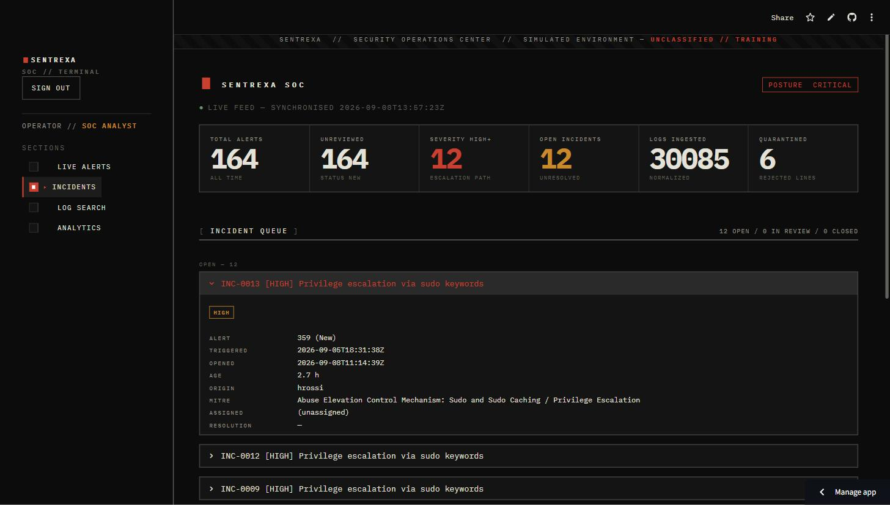

# Sentrexa

🔗 **Live Demo:** https://sentrexa-fzxkw3qwjddmiyjldppw72.streamlit.app/ &nbsp;·&nbsp; login `analyst` / `sentrexa-dev`

**SOC-style log monitoring & alerting dashboard, with a BI & cloud-analytics layer.**

Sentrexa is a simulated Security Operations Center (SOC) monitoring system. It
generates realistic synthetic logs (auth / web / firewall) with deliberately
seeded attack scenarios, normalizes them into PostgreSQL, runs a configurable
**rule-based** (non-ML) detection engine, converts qualifying detections into
severity-tagged alerts mapped to MITRE ATT&CK, auto-escalates high-severity
alerts into incident tickets, and surfaces everything through an auth-gated
Streamlit analyst dashboard plus a weekly HTML report. Phase 7 syncs a
denormalized copy of the alert/incident data into Google BigQuery for three
independent BI dashboards.

## Status

| Phase | Scope | State |
|------:|-------|-------|
| 1 | Log simulation foundation | ✅ done |
| 2 | Ingestion & storage (PostgreSQL) | ✅ done |
| 3 | Detection engine | ✅ done |
| 4 | Alerting, ticketing & MITRE mapping | ✅ done |
| 5 | Dashboard & reporting | ✅ done |
| 6 | Automation, security & deployment | ✅ done |
| 7 | BI & cloud analytics (BigQuery sync + 3 BI connection guides) | ✅ done |

## Architecture

```
[Log Simulator] -> [Ingestion & Normalization] -> [PostgreSQL: logs_raw]
      -> [Detection Rule Engine] (reads detection_rules) -> [Alerts + MITRE mapping]
      -> [high-severity alerts auto-escalate] -> [Incidents]
             |                                        |
             v                                        v
     [Streamlit dashboard]                    [BigQuery sync]  (Phase 7)
     [Weekly report]

GitHub Actions -> schedules the simulate -> ingest -> detect cycle
detection_run_log <- one row per stage, every run
rejected_records  <- malformed log lines, quarantined (never dropped)
```

Modules are isolated by concern: `simulation/`, `ingestion/`, `detection/`,
`alerting/`, `dashboard/`, `reports/`, `bi_export/` (Phase 7), with the shared
data layer in `db/` and all tunables in `config/settings.py`.

## Interface

The dashboard uses a **"declassified terminal"** visual language — near-black
ground, IBM Plex Mono throughout, hard 1px rules, square corners, and a
restrained utilitarian palette (oxidised stamp-red for CRITICAL / classification,
field amber for HIGH / in-review, drab olive for resolved). Severity reads by
descending emphasis and padded `[CRIT]` / `[HIGH]` / `[MED ]` / `[LOW ]`
brackets, not a rainbow. It is built entirely through a `.streamlit/config.toml`
theme + one consolidated CSS block + `st.markdown` HTML fragments
(`dashboard/ui.py`); no data logic changed.

| Live Alerts | Analytics | Incidents |
|---|---|---|
|  |  |  |

## Detection rules

Rules live in the **`detection_rules` table**, never in code — the engine
(`detection/rules_engine.py`) loads the active rows and dispatches one pure
detector per `rule_type`. `detection/seed.py` seeds the three rows below
idempotently.

| Rule | Type | Logic | Default threshold | Severity | MITRE |
|------|------|-------|-------------------|----------|-------|
| SSH brute-force burst | `brute_force` | Failed SSH logins grouped by `source_ip`; a sliding time window of `time_window_minutes` containing ≥ `threshold_value` failures fires. Contributing logs = every failure in a qualifying window. One alert per (rule, IP, day). | ≥ 10 failures in 5 min | high | **T1110.001** Brute Force: Password Guessing (Credential Access) |
| Off-hours successful login | `off_hours_login` | A successful `login` whose UTC hour is inside the rule's `[start_hour, end_hour)` window (wraps past midnight). One alert per login event. | 20:00–06:00 UTC | medium | **T1078.003** Valid Accounts: Local Accounts (Defense Evasion) |
| Privilege escalation via sudo keywords | `privilege_escalation` | An `auth` line whose text contains any keyword in the rule's `params.keywords` (case-insensitive) — e.g. `sudo su`, `usermod -aG sudo`, `GRANT ALL PRIVILEGES`. One alert per offending line. | keyword list in `params` | high | **T1548.003** Abuse Elevation Control Mechanism: Sudo and Sudo Caching (Privilege Escalation) |

**MITRE mapping approach.** `mitre/technique_reference.py` is a small curated
table — only the techniques the rules above use — with a single
`RULE_TYPE_TO_TECHNIQUE` map. The seed writes those techniques into
`mitre_techniques`; each `detection_rules` row carries `mitre_technique_id` as a
foreign key. The `v_alert_enriched` view pre-joins alert → rule → technique →
incident so the dashboard, the report, and (Phase 7) BigQuery all read the same
denormalized shape.

**Idempotency.** Ingestion dedupes on `logs_raw.dedup_hash`; detection consumes
only `processed = false` rows and marks them processed in the same transaction;
alerts upsert on `alerts.dedup_key`. Re-running any stage on the same data is a
no-op.

## Local setup

1. **Python 3.14** and a PostgreSQL database (local or hosted, e.g. Neon).
2. `python -m pip install -r requirements.txt`
3. `cp .env.example .env` and set at least `DATABASE_URL` (the database owner).
   `.env` is gitignored — never commit real credentials.
4. **Bootstrap the database** (idempotent — DDL + views, creates the
   least-privilege `sentrexa_ro` / `sentrexa_rw` roles, writes their generated
   credentials back into `.env`, verifies `ro` cannot write):

   ```
   python -m sql.bootstrap
   python -m detection.seed
   ```

5. **Run the pipeline:**

   ```
   python -m simulation.dataset                 # data/raw/<end>.ndjson + .scenarios.json + _latest.json
   python -m simulation.dataset --inject-malformed 6   # add corrupt lines to exercise quarantine
   python -m ingestion.load                     # newest feed -> logs_raw; bad lines -> rejected_records
   python -m detection.runner                   # dry run: detect + print
   python -m detection.runner --commit          # persist: mark processed, create alerts + incidents, log the run
   ```

6. **Weekly report:**

   ```
   python -m reports.weekly_report              # -> reports/out/weekly_<date>.html
   ```

7. **Dashboard** (needs a login — generate a password hash first):

   ```
   python -m dashboard.hash_password 'your password'   # paste the hash into DASHBOARD_AUTH_PASSWORD_HASH
   streamlit run dashboard/app.py
   ```

8. **BigQuery analytics sync (Phase 7)** — keyless auth, no key file anywhere:

   ```
   gcloud auth application-default login             # once; your own Google account
   gcloud auth application-default set-quota-project sentrexa
   python -m bi_export.schema.bigquery_schema        # create dataset + star schema (idempotent)
   python -m bi_export.sync_to_bigquery              # incremental MERGE  (--full to rebuild)
   ```

9. **Tests** (DB / BigQuery integration tests auto-skip without a database / ADC):

   ```
   pytest -q                 # everything
   pytest -m "not db" -q     # fast, offline
   ```

## Automation (GitHub Actions)

**`.github/workflows/pipeline.yml`** runs `pytest -m "not db"` then
simulate → ingest → detect (`--commit`) every 6 hours (and on demand). Secrets:

```
gh secret set DATABASE_URL     -R <owner>/<repo> --body 'postgresql+psycopg://OWNER:...'
gh secret set DATABASE_URL_RW  -R <owner>/<repo> --body 'postgresql+psycopg://sentrexa_rw:...'
gh secret set DATABASE_URL_RO  -R <owner>/<repo> --body 'postgresql+psycopg://sentrexa_ro:...'
```

**`.github/workflows/bigquery_sync.yml`** runs the BigQuery sync ~30 min after
the pipeline. Authentication is **Workload Identity Federation** — the job mints
an OIDC token that impersonates `sentrexa-bq-sync`; there is **no service-account
key**. Extra secrets (identifiers only, not credentials):

```
gh secret set GCP_PROJECT_ID   -R <owner>/<repo> --body 'sentrexa'
gh secret set GCP_SYNC_SA      -R <owner>/<repo> --body 'sentrexa-bq-sync@sentrexa.iam.gserviceaccount.com'
gh secret set GCP_WIF_PROVIDER -R <owner>/<repo> --body 'projects/<PROJECT_NUMBER>/locations/global/workloadIdentityPools/github-pool/providers/github-provider'
```

(or *Settings → Secrets and variables → Actions* in the GitHub UI). The DB
values are the connection strings `python -m sql.bootstrap` wrote into `.env`.

## Deployment

The dashboard is read-only (`sentrexa_ro`) and gated by
`streamlit-authenticator`. HTTPS is provided by the platform.

**Streamlit Community Cloud** — connect the repo at
[share.streamlit.io](https://share.streamlit.io), set the entrypoint to
`dashboard/app.py`, and paste the keys from
`.streamlit/secrets.toml.example` into the *Secrets* box (real values).
`app.py` mirrors `st.secrets` into the environment so `config/settings.py`
picks them up.

**Render** — `render.yaml` is a ready blueprint; set `DATABASE_URL_RO` and the
`DASHBOARD_AUTH_*` vars as secret env vars in the Render dashboard.

## BI & Cloud Analytics (Phase 7)

### Sync architecture

```
PostgreSQL (sentrexa_ro, read-only)                Google BigQuery: analytics
  alerts / incidents / detection_rules  --.        fact_alerts       (MERGE on alert_id)
  mitre_techniques / logs_raw            |         fact_logs_daily   (MERGE on date+source+type+status)
                                         |  bi_export/               dim_mitre_techniques
                                         '->  sync_to_bigquery.py -> dim_detection_rules
                                                     ^               _sync_state  (watermark)
                                          watermark read/written here (in BigQuery)
                                                     |
   [pipeline.yml] --(after each cycle)--> [bigquery_sync.yml]  (WIF, no key)
                                                     |
                          +--------------------------+--------------------------+
                          v                          v                          v
                   Looker Studio               Power BI                     Tableau
                   (your Google OAuth)   (your Google OAuth)         (your Google OAuth)
```

* **Read side** — the sync only ever `SELECT`s from PostgreSQL, through the
  least-privilege `sentrexa_ro` role. It never writes the operational database.
* **Watermark** — `analytics._sync_state` in BigQuery holds one
  `last_synced_at` per target. `fact_alerts` re-syncs rows whose
  `GREATEST(alert.updated_at, incident.updated_at)` beats the watermark (a
  `BEFORE UPDATE` trigger maintains those columns); `fact_logs_daily` recomputes
  daily counts only for dates that received logs since the watermark.
* **Idempotent** — every load stages into `_stage_<table>` (`WRITE_TRUNCATE`)
  and then `MERGE`s on the table's natural key, so re-running the sync (or a
  failed-then-retried run) never produces a duplicate row. `tests/test_bi_sync.py`
  asserts this.
* **Keyless auth** — local runs use your own ADC
  (`gcloud auth application-default login`); CI uses Workload Identity
  Federation (`google-github-actions/auth@v2`) to impersonate
  `sentrexa-bq-sync`. No service-account JSON key file exists in this project
  (the GCP project enforces `iam.disableServiceAccountKeyCreation`).
* **Not synced** — `logs_raw` is never copied to BigQuery; only alert-level and
  daily-aggregated data leaves PostgreSQL.

### Star schema (`analytics` dataset)

| Table | Grain | Natural key | Notes |
|-------|-------|-------------|-------|
| `fact_alerts` | one row per alert | `alert_id` | fully denormalized: rule + MITRE technique/tactic + incident outcome pre-joined. Partitioned on `triggered_at`, clustered on `(severity, mitre_technique_id)`. |
| `fact_logs_daily` | one row per `day × source_system × event_type × status` | those 4 columns | `event_count` per bucket. Partitioned on `log_date`, clustered on `(source_system, event_type)`. |
| `dim_mitre_techniques` | one row per technique | `technique_id` | `technique_id, technique_name, tactic, description` |
| `dim_detection_rules` | one row per rule | `rule_id` | `rule_id, rule_name, rule_type, severity` |
| `_sync_state` | one row per sync target | `target_name` | internal watermark; BI tools ignore it |

**`fact_alerts` columns:** `alert_id, triggered_at, severity, alert_status,
rule_id, rule_name, rule_type, mitre_technique_id, technique_name, tactic,
source_ip, username, incident_id, incident_status, opened_at, closed_at,
resolution_hours, row_modified_at, synced_at`.

**Relationships for the BI model:**
`fact_alerts.rule_id → dim_detection_rules.rule_id` (many-to-one),
`fact_alerts.mitre_technique_id → dim_mitre_techniques.technique_id` (many-to-one).
`fact_alerts` is already denormalized, so the dims are optional convenience
lookups. `fact_logs_daily` stands alone (relate on `log_date` to a BI-generated
date table if desired).

### GCP resources (already provisioned)

| | |
|---|---|
| Project ID / number | `sentrexa` / `956140125620` |
| Dataset | `sentrexa.analytics` (location **US**) |
| Sync service account | `sentrexa-bq-sync@sentrexa.iam.gserviceaccount.com` — `roles/bigquery.jobUser` + `roles/bigquery.dataEditor` |
| Workload Identity pool / provider | `github-pool` / `github-provider`, OIDC issuer `token.actions.githubusercontent.com`, condition `assertion.repository == 'l1kshay/Sentrexa'` |
| BI-tool auth | **your own Google account via OAuth** — no reader service account, no key file |

The exact `gcloud` commands used are in
[`bi_export/PROVISIONING.md`](bi_export/PROVISIONING.md).

### Connecting the three BI tools

All three connect **read-only** to BigQuery using **"Sign in with Google"
(OAuth)** with your project-Owner account. Common values:

* **Billing / query project:** `sentrexa`
* **Dataset:** `analytics`
* **Tables:** `fact_alerts`, `fact_logs_daily`, `dim_mitre_techniques`, `dim_detection_rules`

#### 1 — Looker Studio (shareable public link)

1. [lookerstudio.google.com](https://lookerstudio.google.com) → **Create → Data source**.
2. Pick the **BigQuery** connector (by Google) → **Authorize** with your Google account.
3. **My Projects → `sentrexa` → `analytics` → `fact_alerts` → Connect**. Add
   `fact_logs_daily` as a second data source the same way.
4. **Add to report.** Suggested tiles:
   * Scorecards: `Record Count` (alerts), `incident_id` (COUNT DISTINCT, filter `incident_status = "Open"`), `resolution_hours` (AVG → "mean time to resolve").
   * Time series: dimension `triggered_at` (by day), metric `Record Count`, breakdown dimension `severity`.
   * Bar: dimension `tactic` (or `technique_name`), metric `Record Count`.
   * Table: dimension `source_ip`, metric `Record Count`, sorted desc.
   * From `fact_logs_daily`: stacked column, dimension `log_date`, metric `event_count`, breakdown `source_system`.
5. **Share → Manage access → Anyone with the link → Viewer** for the portfolio link.

#### 2 — Power BI Desktop (import mode, ≥1 DAX measure + drill-through)

1. **Home → Get data → More… → Database → Google BigQuery → Connect**.
2. Leave *Billing Project ID* = `sentrexa` (or blank) → **OK**.
3. **Sign in → Sign in with Google →** your Owner account → **Connect**.
4. **Navigator:** expand `sentrexa → analytics`, tick `fact_alerts`,
   `fact_logs_daily`, `dim_mitre_techniques`, `dim_detection_rules` → **Load**
   (Import; DirectQuery also works).
5. **Model view:** create relationships if not auto-detected —
   `fact_alerts[rule_id] → dim_detection_rules[rule_id]` and
   `fact_alerts[mitre_technique_id] → dim_mitre_techniques[technique_id]`, both
   many-to-one, single cross-filter.
6. **DAX measures** (New measure):
   ```DAX
   Mean Time To Resolve (h) = AVERAGE ( fact_alerts[resolution_hours] )

   Open Incidents =
   CALCULATE ( DISTINCTCOUNT ( fact_alerts[incident_id] ),
               fact_alerts[incident_status] = "Open" )

   High-Severity Rate =
   DIVIDE (
       CALCULATE ( COUNTROWS ( fact_alerts ),
                   fact_alerts[severity] IN { "high", "critical" } ),
       COUNTROWS ( fact_alerts )
   )
   ```
7. **Drill-through:** add a page named **Alert detail** with a table of
   `alert_id, triggered_at, severity, rule_name, technique_name, source_ip,
   username, incident_status, resolution_hours`. In the *Visualizations →
   Drill through* well drop `mitre_technique_id` (or `rule_name`). On a summary
   page, right-click a bar → **Drill through → Alert detail**.
8. Optionally **Publish** to the Power BI service.

#### 3 — Tableau (Public) — time-of-day attack heatmap (deliberately distinct)

1. **Connect → To a Server → Google BigQuery**.
2. **Authentication: Sign In with OAuth →** your Google account → **Allow**.
3. *Billing Project* = `sentrexa`, *Project* = `sentrexa`, *Dataset* = `analytics`.
4. Drag **`fact_alerts`** to the canvas (no join needed — it's denormalized).
5. Create calculated fields:
   ```
   Hour of Day  =  DATEPART('hour', [Triggered At])
   Day of Week  =  DATENAME('weekday', [Triggered At])
   ```
6. Build the heatmap:
   * **Columns:** `Hour of Day` (Discrete, 0–23)
   * **Rows:** `Day of Week` (Discrete; sort Monday→Sunday)
   * **Marks:** type **Square**; **Color** = `CNT(Alert Id)`; **Label** = `CNT(Alert Id)`
   * Optional shelf filters: `Severity`, `Rule Type`
   * A diverging/sequential colour ramp makes the night-time brute-force and
     off-hours-login clusters obvious at a glance.
7. Add a companion sheet if you like: bar of `CNT(Alert Id)` by `Tactic`, or a
   line of `SUM(Event Count)` by `Log Date` from `fact_logs_daily`.
8. **Server → Tableau Public → Save** for the portfolio link.

> `source_ip` values are RFC 5737 documentation addresses (not geolocatable), so
> the time-of-day heatmap is the meaningful "distinct" visual rather than a geo map.

## Security

- No hardcoded credentials — `.env` locally, GitHub Actions / platform secrets in CI/deploy.
- SQLAlchemy ORM / bound parameters only — no string-built SQL anywhere.
- Least-privilege roles: `sentrexa_ro` (SELECT only) for the dashboard & reports,
  `sentrexa_rw` (SELECT/INSERT/UPDATE, no DELETE, no DDL) for the pipeline.
- Malformed log lines are quarantined into `rejected_records`, never dropped or
  allowed to crash the pipeline.
- Login gate on the dashboard before deployment; password stored only as a
  bcrypt hash.
- Simulated usernames / IPs are treated as PII; external addresses are drawn
  only from RFC 5737 documentation ranges.
- **No BigQuery key files** — CI authenticates via Workload Identity Federation
  (short-lived OIDC token → SA impersonation), local runs and BI tools via your
  own Google account. `logs_raw` is never exported; only alert-level and
  aggregated data leaves PostgreSQL.
- The BigQuery sync reads PostgreSQL only through the read-only role and writes
  nothing back to it.

## License

MIT — see [LICENSE](LICENSE).
